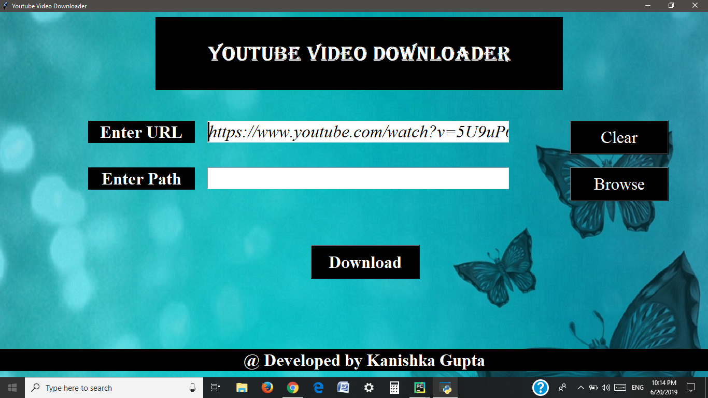

# Youtube_Video_Downloader_GUI👩‍💻

## Code Requirements
- Tkinter (Available in pyhton)
- youtube_dl library

## About
It is a GUI in which by entering URL from youtube you can directly download video and save it by giving path accordingly.

## Explanation Through Screenshots
### --> Main Screen

### --> Enter URL

### --> Enter Path and Download

## Note
- youtube_dl library needs Python 3.6 as Project Interpreter (not Python 3.7).

## 👉Do Follow and ⭐the repository if you find it helpful.
